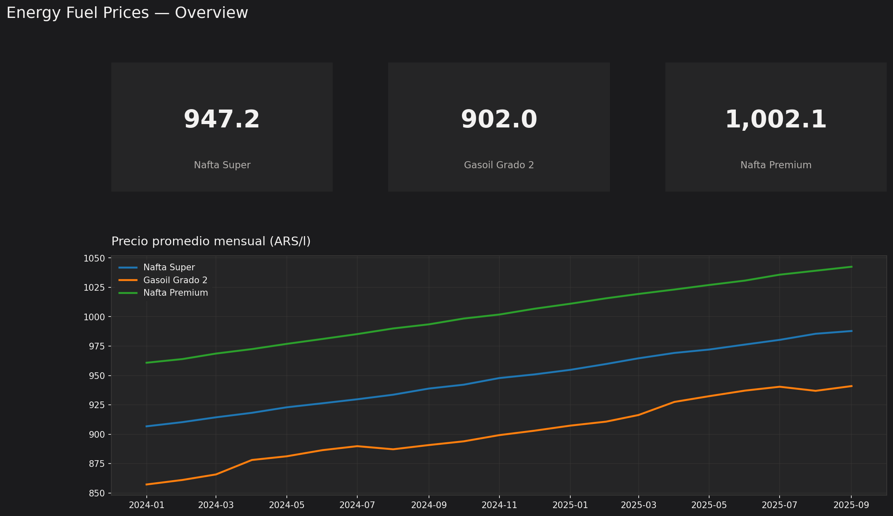

# Argentina Energy Analytics (Data Analyst)

Exploratory analysis on **public** Argentine fuel-price data: **DuckDB inside Python**, versioned SQL, Power BI, and a one-page memo. No cloud billing.



## How the warehouse works here

DuckDB is a SQL engine you install **in the project** (`pip install duckdb`). It is not DBeaver and not a program you open on the desktop. Python loads the CSV, DuckDB runs the `.sql` files, results go to `output/`.

That is the analyst loop (same idea as querying BigQuery, without Google):

```
CSV (GitHub)
    → DuckDB (pip, in this repo's venv)
    → sql/01–05
    → output/*.csv
    → Power BI (same CSV)
```

| On GitHub | On your machine |
|-----------|-----------------|
| `data/fuel_prices_public_sample.csv` + `sql/*.sql` | `pip install -r requirements.txt` then `python scripts/build_duckdb.py` |

`data/energy.duckdb` is built locally (gitignored). Recreate it anytime from the CSV.

PostgreSQL in Docker is **optional** (same table, port 5435) if you want a server-shaped warehouse. Daily work is DuckDB.

## Business questions

| # | Question | SQL |
|---|----------|-----|
| 1 | How did national average fuel prices move month over month? | `sql/01_price_trends.sql` |
| 2 | Which fuel type shows the widest price spread across provinces? | `sql/02_price_dispersion.sql` |
| 3 | Is there a seasonal pattern in diesel vs gasoline? | `sql/03_seasonality.sql` |
| 4 | Which regions concentrate the highest posted prices? | `sql/04_regional_rank.sql` |
| 5 | What would we monitor weekly on an operations desk? | `sql/05_weekly_watch.sql` |

## Stack

- Python 3.12 + pandas (CSV checks)
- **DuckDB** (`pip install duckdb` via `requirements.txt`)
- SQL in `sql/`
- **Power BI** (`powerbi/EnergyFuelPrices.pbip`)
- Memo: `memo/ANALYST_MEMO.md`

## Quick start

```powershell
cd Proyectos\energy-analytics-ar
python -m venv .venv
.\.venv\Scripts\Activate.ps1
pip install -r requirements.txt
python scripts/build_duckdb.py
python scripts/run_all_sql.py
python -m pytest -q
```

Run one question from Python:

```python
import duckdb
con = duckdb.connect("data/energy.duckdb")
print(con.sql(open("sql/01_price_trends.sql", encoding="utf-8").read()))
```

## Optional: Postgres in Docker

```powershell
docker compose up -d
python scripts/load_warehouse.py
```

Same schema (`fuel_prices`). Not required for analysis.

## Power BI

Open `powerbi/EnergyFuelPrices.pbip` in Power BI Desktop.

## Data limits

`data/fuel_prices_public_sample.csv` is a **curated demo**. Replace with a [datos.gob.ar](https://datos.gob.ar) export (see `data/README.md`). Do not infer refinery margin or consumption from price alone.

## License

MIT — portfolio demonstration project.
